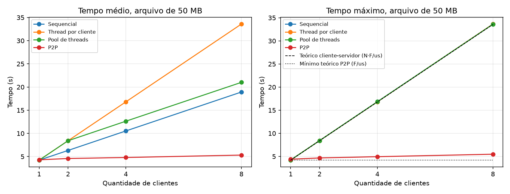

# Transferência de arquivos: cliente-servidor x P2P

Atividade 01 da Unidade 2 de Sistemas Distribuídos (COMP0470, UFS), Prof. Rafael Oliveira Vasconcelos.

Avaliação de desempenho da transferência de um arquivo nas arquiteturas cliente-servidor (servidor sequencial, servidor com uma thread por cliente e servidor com pool de threads) e P2P, variando o tamanho do arquivo e a quantidade de clientes. O relatório está em [relatorio/relatorio.pdf](relatorio/relatorio.pdf).

## Estrutura

- `src/main/java/transferencia`: código em Java 17
  - `ServidorSequencial`, `ServidorThreads` e `ServidorPool`: as três variações do servidor
  - `Cliente`: recebe o arquivo, descarta os bytes e mostra o tempo
  - `Tracker` e `Peer`: programa P2P, com pedaços de 256 KB como no BitTorrent
  - `LimiteBanda`: limite de upload de cada nó
  - `GeradorArquivos`: gera os arquivos de teste de 5, 50 e 500 MB
- `scripts`: execução dos experimentos, análise dos resultados e diagnóstico do disco
- `resultados`: tempos medidos, resumo e gráficos
- `relatorio`: relatório em PDF

## Como simular

Precisa do Docker com o Compose e do bash (no Windows, pelo WSL). Para os gráficos, Python 3 com matplotlib.

Cada servidor, cliente e peer roda em um container, com upload limitado a 100 Mbit/s. Sem esse limite, como os containers estão na mesma máquina, a transferência seria quase instantânea e não daria para comparar as arquiteturas.

### Todos os experimentos

```bash
bash scripts/experimentos.sh
python scripts/analisar.py
```

O primeiro script gera a imagem e os arquivos de teste e roda as 144 combinações: sequencial, thread por cliente, pool de 2 threads e P2P, com arquivos de 5, 50 e 500 MB, 1, 2, 4 e 8 clientes e 3 repetições. Em cada execução os clientes começam no mesmo instante. Leva cerca de 3 horas e, se for interrompido, continua de onde parou. O segundo calcula os tempos mínimo, médio e máximo (`resultados/resumo.csv`) e gera os gráficos.

Como os resultados já estão no repositório, o script pula o que já foi medido. Para medir de novo, apague antes `resultados/tempos.csv` e `resultados/origem_p2p.csv`. Para uma rodada rápida:

```bash
TAMANHOS=5 CLIENTES="1 2" REPETICOES=1 bash scripts/experimentos.sh
```

### Um cenário de cada vez

Gerar a imagem e os arquivos de teste (uma vez):

```bash
docker compose run --rm gerador
```

Cliente-servidor com 4 clientes. `MODO` pode ser `Sequencial`, `Threads` ou `Pool`, e `MAXIMO` é o tamanho do pool:

```bash
MODO=Threads ARQUIVO=arquivo_50MB.bin docker compose up -d servidor
docker compose up --scale cliente=4 cliente
docker compose --profile cs down
```

P2P com 4 peers, além do semeador:

```bash
ARQUIVO=arquivo_50MB.bin docker compose up -d tracker semeador
docker compose up -d --scale peer=4 peer
docker compose logs -f peer
docker compose --profile p2p down
```

O limite de upload muda com `BANDA_MBPS` (em Mbit/s). No PowerShell, as variáveis são definidas antes do comando, por exemplo `$env:MODO="Threads"`.

### Sem Docker

```bash
mvn package
java -cp target/transferencia.jar transferencia.GeradorArquivos arquivos 5 50 500

java -cp target/transferencia.jar transferencia.ServidorPool 5000 arquivos/arquivo_50MB.bin 4
java -cp target/transferencia.jar transferencia.Cliente localhost 5000 cliente1

java -cp target/transferencia.jar transferencia.Tracker 6000
java -cp target/transferencia.jar transferencia.Peer localhost 6000 7000 semeador arquivos/arquivo_50MB.bin
java -cp target/transferencia.jar transferencia.Peer localhost 6000 7001 peer1
```

Os outros servidores são iniciados da mesma forma, sem o último argumento (`ServidorSequencial` e `ServidorThreads`). Cada peer precisa de uma porta diferente.

## Resultados

Tempo máximo, em segundos, para os 8 clientes receberem o arquivo:

| Arquivo | Sequencial | Thread por cliente | Pool de 2 threads | P2P |
|---|---:|---:|---:|---:|
| 5 MB | 3,40 | 3,41 | 3,41 | 1,29 |
| 50 MB | 33,64 | 33,64 | 33,61 | 5,49 |
| 500 MB | 335,62 | 335,63 | 335,62 | 181,31 |

No cliente-servidor o tempo máximo das três variações é praticamente N·F/us, porque o upload do servidor é o gargalo; o que muda entre elas é o tempo médio. No P2P os peers repassam os pedaços entre si e o tempo quase não cresce com a quantidade de clientes. Os tempos mínimo, médio e máximo de todas as combinações estão em `resultados/resumo.csv`.



Com 500 MB o P2P ficou acima do tempo previsto porque cada peer grava os pedaços em disco e todos os containers dividem o mesmo disco da máquina. Os registros dessa medição estão em `resultados/diagnostico` e podem ser refeitos com:

```bash
bash scripts/diagnostico.sh 500 8
```
